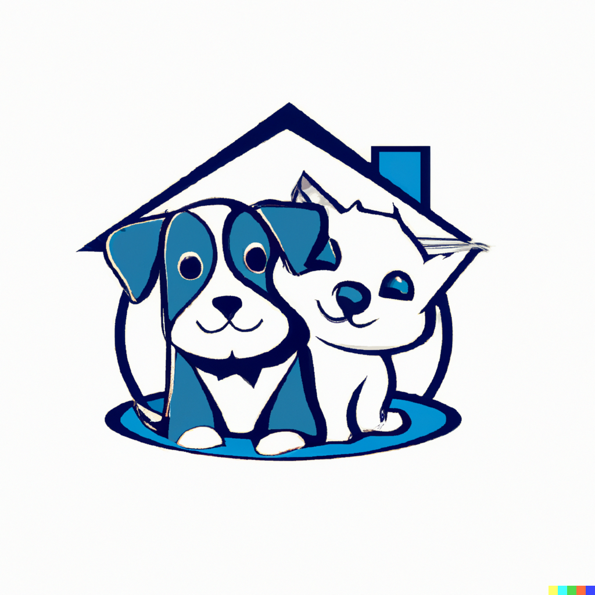
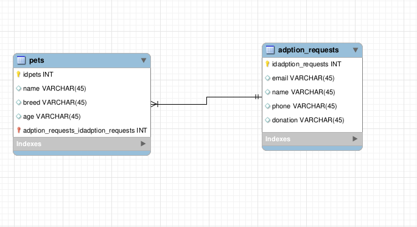

### Owners 
### Rodrigo Britez Junior
### Conrado Ribeiro Bibiano

## Prelude

<b>PetsGoHome</b> is a service created to help find people who are willing to adopt animals that are up for adoption.
The idea is helping NGOs to adopt animals that are looking for a home is like a public notice where the NGO publishes the animals available for adoption, then interested people will choose the animal leaving contact information and a possible donation to help the NGO.

 

## Stories

As a <b>Organization</b>, I would like to register the pets waiting for adoption, so them have a home.

As a <b>Organization</b>, I would like to generate a report of adopts, so that i have a controll.

As a <b>Organization</b>, I would like to see requests of adoption, so that i can contact the client.

As a <b>Organization</b>, I would like to remove pets from catalog, so that i can inform pets already adopts.

As a <b>Organization</b>, I would like to have a log from all adopts and donations, so that i can information if something happen.

As a <b>Client</b>, I would like to see information of the pet, so that i'm prepared for any need.

As a <b>Client</b>, I would like to send my contact, so that the company can contact me.

 

## Diagram

